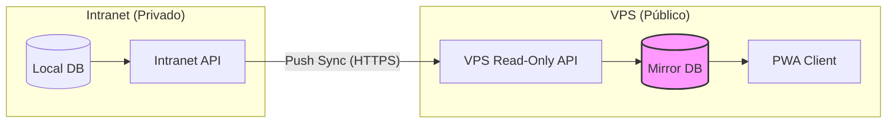

# Plano: VPS como Espelhamento de Leitura (Read-Only Mirror)

Como o PWA precisa apenas **ler** os dados, podemos simplificar drasticamente a arquitetura. A VPS deixará de ser uma "segunda API" para se tornar um **Cache Público de Alta Performance**.

## 🏗️ 1. Fluxo Unidirecional de Dados

A segurança é garantida pelo fato de que a VPS **não possui endpoints de escrita** expostos para o PWA.

---

## 🛠️ 2. Detalhes da Implementação

### 📡 A. Sincronização por Eventos (Push Only)
A Intranet continuará sendo a "Dona da Verdade".
- **O que sincronizar:** Apenas o necessário para o cliente ver (Status, Número do Pedido, Cliente, Previsão e Resumo de Itens).
- **Como sincronizar:** O `VpsSyncService` já existente na Intranet envia o payload. Se o pedido mudar na Intranet, a VPS é atualizada em milissegundos.

### 🔒 B. Segurança de "Mão Única"
- **API VPS:** Terá apenas rotas `GET` (Listar e Ver Detalhes).
- **Proteção:** A única rota de `POST` (Sincronização) será protegida por um IP Fixo (da sua empresa) e uma `API_KEY` secreta.
- **PWA:** O PWA não terá campos de edição ou botões de "Salvar". Ele apenas consulta.

### 🖼️ C. Miniaturas de Imagens (Thumbnails)
Para economizar banda e processamento na VPS:
- A Intranet gera uma versão pequena (thumbnail) da foto do pedido.
- Essa versão pequena é enviada para a VPS no momento do sincronismo.
- O PWA lê a imagem diretamente da VPS.

---

## ✅ 3. Vantagens deste Modelo

1.  **Imunidade a Ataques:** Como não há rotas de escrita para o público, é impossível alguém deletar ou alterar seus dados pela internet.
2.  **Performance Absurda:** A VPS terá um banco de dados muito leve (apenas o essencial). As consultas no PWA serão instantâneas.
3.  **Custo Baixo:** Você pode usar uma VPS simples (1GB RAM), pois o processamento pesado (geração de PDFs, cálculos complexos) continua na Intranet.
4.  **Autonomia:** Se a internet da sua empresa cair, a VPS continua funcionando e mostrando os últimos dados sincronizados para os clientes.

---

## 🚀 4. Próximos Passos Sugeridos

1.  **Limpeza de Payload:** Definir exatamente quais campos do Pedido o PWA deve enxergar.
2.  **Script de Sincronismo Inicial:** Criar um comando na Intranet para enviar todos os pedidos ativos para a VPS (carga inicial).
3.  **Webhook de Status:** Configurar para que, sempre que um setor (costura, expedição) der baixa no tablet local, o PWA reflita isso imediatamente.

> [!TIP]
> **Dica de Segurança:**
> Podemos configurar a VPS para que as rotas de leitura exijam um "Código de Acesso" ou apenas o "Número do Pedido + CPF/CNPJ", evitando que robôs vasculhem seus dados.
